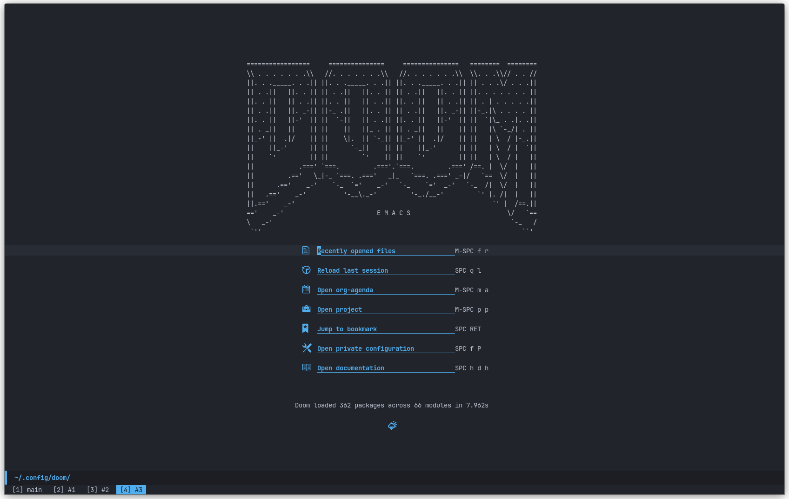
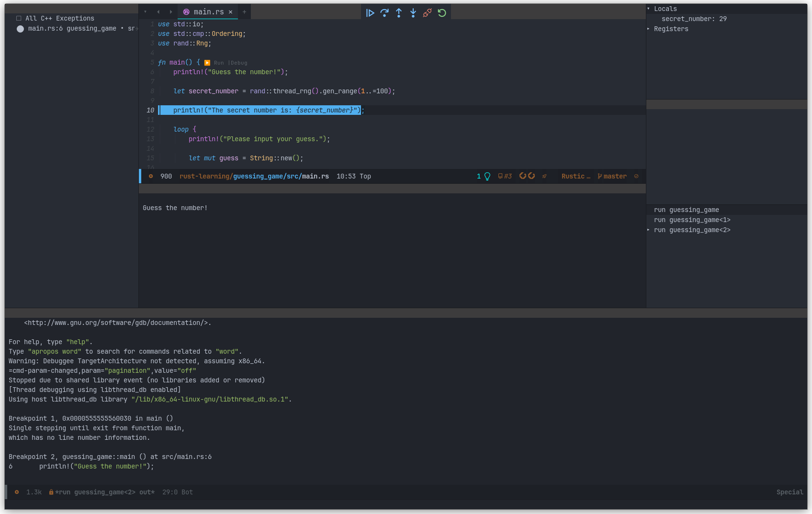

# Doom Emacs Config

## Images





## Literate Config
Found in: [config.org](./config.org)

## Pre-requisites

- **Fonts**

You can download the JetBrains font here: [JetBrains Mono Font](https://www.jetbrains.com/lp/mono/)
> [!NOTE]
> The variable pitch font for `org-mode` files use Cantarall font. Should be installed by default on distros like Ubuntu and Pop!_OS. If not, please download and install this font as well.

- **Install pip**

``` bash
sudo apt install python3-pip
```

- **Install Pyright LSP Server**

``` bash
pip install pyright
```

- **Install CCLS LSP Server**

``` bash
sudo apt install ccls
```

- **Install Rust and `rust-analyzer`**

Install rust by following the official website: [Install Rust](https://www.rust-lang.org/tools/install)

And now install `rust-analyzer`

``` bash
rustup componet add rust-analyzer
```

If you want to update components added from `rustup`, run:

``` bash
rustup update
```

- **Install `texlab` LSP Server**

Installation instructions: [texlab GitHub](https://github.com/latex-lsp/texlab)

- **Install GDB**

`gdb` is used for Rust and C/C++ debugging

``` bash
sudo apt install gdb
```

- **Install `gnome-screenshot`**

This is needed for `org-download-clipboard` to work.

``` bash
sudo apt install gnome-screenshot
```

- **Install `graphviz`**

This is needed for `org-roam` to generate graph visualisations

``` bash
sudo apt install graphviz
```
